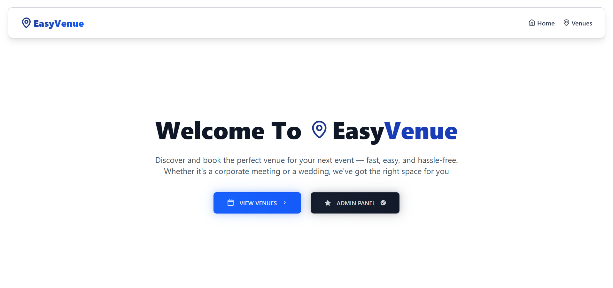
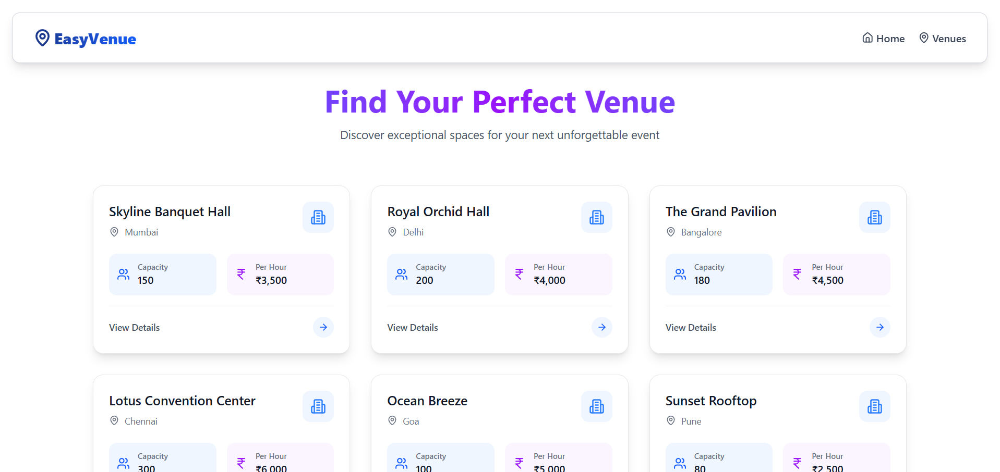
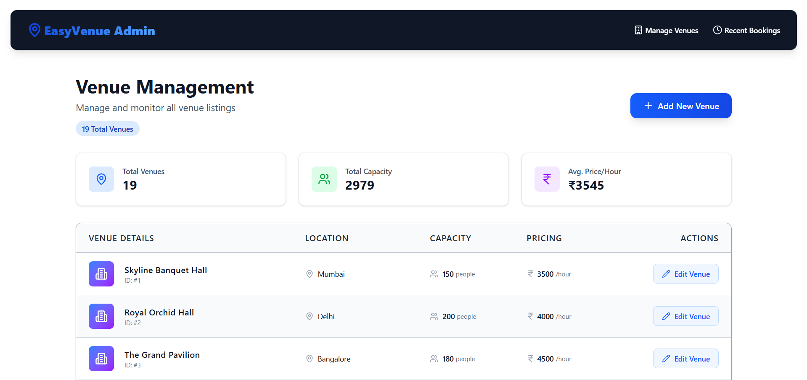
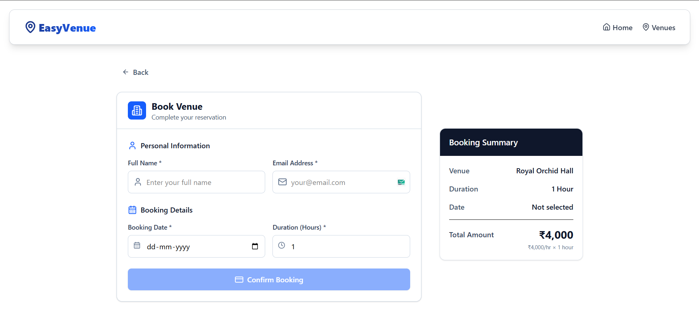
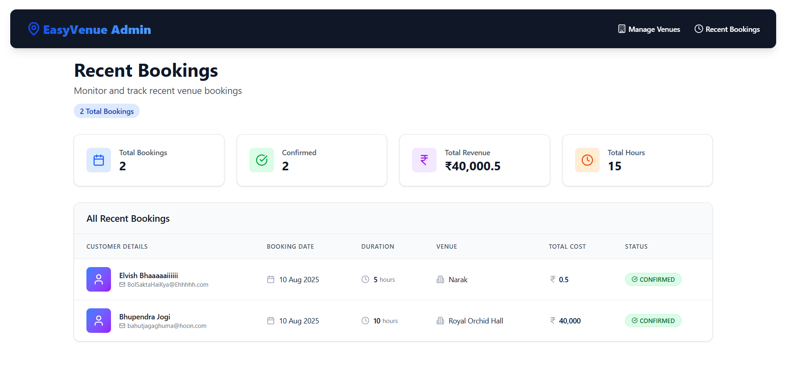

# EasyVenue - Mini Venue Booking Platform

A full-stack web application built for **venue owners and users** to manage and book event spaces. Features a modern Java Spring Boot backend with React frontend, designed with scalable architecture, modular codebase, and RESTful API best practices.

## Requirements to run this app in your system (IMPORTANT)
- Need maven installation to run the command mvn spring-boot:run
- Need node js for react to run in the frontend
- Need Mysql with easyvenue named database
- Need to map the Mysql details in the application.properties file in the backend properly
- Check whether the frontend local host or deployment url is present in the cors allowed url in the Security Config currently for developement purposes all origins are allowed *
- Check whether the backend url is present in the VITE_API_BASE_URL in the env file if local run or in the secrets if cloud deployment when you you publish to firebase build it with the value     in the env file it will automatically take the value from the env file


## 🚀 Features

### 🛠️ Admin (Venue Owners)

- Add new venues with venue name, location, capacity, and pricing details
- Mark dates as unavailable (e.g., for offline bookings)
- View list of venues with control over availability
- View recent bookings and manage venue operations

### 👥 User (Public)

- Browse available venues with detailed information
- Book a venue for specific dates by filling form which includes user name, email, booking date, and duration
- View booking confirmation and details

## 📁 Project Structure

```bash
EasyVenue/
├── Backend/                    # Java Spring Boot, JPA/Hibernate
│   ├── pom.xml
│   └── src/
│       ├── main/
│       │   ├── java/com/easyvenue/backend/
│       │   │   ├── BackendApplication.java
│       │   │   ├── config/
│       │   │   │   └── VenueDataInitializer.java
│       │   │   ├── controller/
│       │   │   │   ├── BookingController.java
│       │   │   │   └── VenueController.java
│       │   │   ├── dto/
│       │   │   │   ├── AvailabilityUpdateRequest.java
│       │   │   │   └── BookingRequest.java
│       │   │   ├── model/
│       │   │   │   ├── Booking.java
│       │   │   │   └── Venue.java
│       │   │   ├── repository/
│       │   │   │   ├── BookingRepository.java
│       │   │   │   └── VenueRepository.java
│       │   │   └── service/impl/
│       │   │       ├── BookingService.java
│       │   │       └── VenueService.java
│       │   └── resources/
│       │       └── application.properties
│       └── test/
│           └── java/com/easyvenue/backend/
│               └── BackendApplicationTests.java
└── Frontend/                   # React, Vite, Modern CSS
    ├── README.md
    ├── eslint.config.js
    ├── index.html
    ├── package.json
    ├── vite.config.js
    ├── .env.example
    └── src/
        ├── App.jsx
        ├── index.css
        ├── main.jsx
        ├── components/
        │   ├── Footer.jsx
        │   └── Navbars/
        │       ├── AdminNavbar.jsx
        │       └── PublicNavbar.jsx
        ├── hooks/
        │   ├── useBookingMutation.js
        │   └── useVenues.js
        ├── layouts/
        │   ├── AdminLayout.jsx
        │   └── PublicLayout.jsx
        ├── pages/
        │   ├── NotFound.jsx
        │   ├── admin/
        │   │   ├── AddVenueForm.jsx
        │   │   ├── AdminVenueList.jsx
        │   │   ├── AvailabilityForm.jsx
        │   │   └── RecentBookings.jsx
        │   └── user/
        │       ├── BookingForm.jsx
        │       ├── BookingSuccess.jsx
        │       ├── HomePage.jsx
        │       ├── VenueDetails.jsx
        │       └── VenueList.jsx
        └── services/
            ├── apiClient.js
            ├── bookingService.js
            └── venueService.js
```

## 📦 Tech Stack

### 🧠 Frontend (Latest Versions)

| Tech / Library               | Version | Purpose                                                                                                            |
| ---------------------------- | ------- | ------------------------------------------------------------------------------------------------------------------ |
| **React**                    | 18.3+   | Core library for building UI                                                                                       |
| **Vite**                     | 5.4+    | Fast dev server and build tool                                                                                     |
| **React Router DOM**         | 6.26+   | Client-side routing                                                                                                |
| **Axios**                    | 1.7+    | Promise-based HTTP client for API communication                                                                    |
| **ESLint**                   | 9.9+    | Code linting and quality assurance                                                                                 |
| **Modern CSS/Styled Components** | Latest | Styling and responsive design                                                                                   |

### 🔧 Backend (Latest Versions)

| Tech / Library           | Version | Purpose                                    |
| ------------------------ | ------- | ------------------------------------------ |
| **Java**                 | 21 LTS  | Programming language                       |
| **Spring Boot**          | 3.3+    | Application framework                      |
| **Spring Web**           | 6.1+    | RESTful web services                       |
| **Spring Data JPA**      | 3.3+    | Data persistence and ORM                   |
| **Hibernate**            | 6.5+    | JPA implementation                         |
| **Maven**                | 3.9+    | Dependency management and build tool       |
| **H2/MySQL Database**    | Latest  | Data storage (configurable)               |
| **Spring Boot DevTools** | 3.3+    | Development productivity tools             |

## 📌 API Endpoints

### 🔍 Venue Routes

| Method | Endpoint                         | Description                        |
|--------|----------------------------------|------------------------------------|
| GET    | `/api/venues`                    | List all venues                    |
| GET    | `/api/venues/{id}`               | Get venue details                  |
| POST   | `/api/venues`                    | Create a new venue (Admin)         |
| PATCH  | `/api/venues/{id}/availability`  | Update venue availability          |

### 📅 Booking Routes

| Method | Endpoint                   | Description                              |
|--------|----------------------------|------------------------------------------|
| POST   | `/api/bookings`            | Book a venue (with availability check)  |
| GET    | `/api/bookings/venue/{id}` | Get bookings for a venue (admin)        |
| GET    | `/api/bookings/recent`     | Get recent bookings                      |

## 📌 Frontend Route Mapping

### 👥 Public/User Routes (PublicLayout)

| **Frontend Route**       | **Component**    | **Required API Endpoint(s)**                                                                   | **HTTP Method(s)**  |
| ------------------------ | ---------------- | ---------------------------------------------------------------------------------------------- | ------------------- |
| `/`                      | `HomePage`       | `GET /api/venues` *(featured/latest venues)*                                                   | `GET`               |
| `/venues`                | `VenueList`      | `GET /api/venues` *(list all venues)*                                                          | `GET`               |
| `/venues/{venueId}`      | `VenueDetails`   | `GET /api/venues/{id}` *(get details of a single venue)*                                       | `GET`               |
| `/book/{venueId}`        | `BookingForm`    | `POST /api/bookings` *(submit booking request)*`GET /api/venues/{id}` *(for venue details)* | `GET`, `POST`       |
| `/book/{venueId}/success`| `BookingSuccess` | *(Confirmation display)*                                                                        | -                   |

### 🛠️ Admin Routes (AdminLayout)

| **Frontend Route**               | **Component**      | **Required API Endpoint(s)**                                                                                     | **HTTP Method(s)** |
| -------------------------------- | ------------------ | ---------------------------------------------------------------------------------------------------------------- | ------------------ |
| `/admin/venues`                  | `AdminVenueList`   | `GET /api/venues` *(admin list view)*                                                                            | `GET`              |
| `/admin/venues/add`              | `AddVenueForm`     | `POST /api/venues` *(create new venue)*                                                                          | `POST`             |
| `/admin/venues/{id}/availability`| `AvailabilityForm` | `PATCH /api/venues/{id}/availability` *(update blocked dates)*`GET /api/venues/{id}` *(venue info)*         | `GET`, `PATCH`     |
| `/admin/bookings/recent`         | `RecentBookings`   | `GET /api/bookings/recent` *(get recent bookings)*                                                               | `GET`              |

## 🧪 How to Run Locally

### Prerequisites

- **Java 21 LTS** installed
- **Node.js 20+** and npm/yarn
- **Maven 3.9+** for dependency management
- **Git** for version control

### Clone the project

```bash
git clone 
cd VenueBook
```

### 🔧 Backend Setup

```bash
cd backend

# Install dependencies and compile
./mvnw clean install

# Run the application
./mvnw spring-boot:run
```

The backend will start on `http://localhost:8080`

### Configure Database (Optional)

Update `src/main/resources/application.properties`:

```properties
# For H2 (default - in-memory)
spring.datasource.url=jdbc:h2:mem:testdb
spring.h2.console.enabled=true

# For MySQL (uncomment and configure)
# spring.datasource.url=jdbc:mysql://localhost:3306/easyvenue
# spring.datasource.username=your_username
# spring.datasource.password=your_password
```

### 🌐 Frontend Setup (In another terminal)

```bash
cd frontend

# Install dependencies
npm install

# Create .env file if needed
cp .env.example .env

# Start development server
npm run dev
```

The frontend runs on `http://localhost:5173` and connects to the backend on `http://localhost:8080`.

## 📸 Screenshots

### Home Page - Welcome to EasyVenue
*Landing page showcasing featured venues and platform introduction*


*Complete listing of all venues with search and filter capabilities*


*Administrative interface for managing venues and viewing analytics*


*User-friendly booking form with date selection and venue details*


*Administrative view of recent bookings and booking management*



### Backend Architecture

- **Controllers**: Handle HTTP requests and responses with proper status codes
- **Services**: Business logic implementation with transaction management
- **Repositories**: Data access layer using Spring Data JPA with custom queries
- **Models**: JPA entities with proper relationships and validation
- **DTOs**: Data Transfer Objects for clean API communication
- **Config**: Application configuration and data initialization

### Frontend Architecture

- **Layouts**: Shared layout components for admin and public views
- **Pages**: Route-specific page components with proper state management
- **Components**: Reusable UI components following atomic design principles
- **Hooks**: Custom React hooks for API calls and state management
- **Services**: API client layer with error handling and interceptors

## 🚀 Deployment

### Backend Deployment

```bash
# Build JAR file
./mvnw clean package

# Run JAR
java -jar target/backend-0.0.1-SNAPSHOT.jar

# Or with profile
java -jar -Dspring.profiles.active=prod target/backend-0.0.1-SNAPSHOT.jar
```

### Frontend Deployment

```bash
# Build for production
npm run build

# Preview build locally
npm run preview

# Deploy dist/ folder to your hosting service
```

## 📃 Key Features Implemented

- **Modern Java Stack**: Spring Boot 3 with Java 21 LTS features
- **RESTful API Design**: Clean API endpoints with proper HTTP methods and status codes
- **Data Validation**: DTO-based request validation with custom validators
- **Component Architecture**: Modular React components with custom hooks
- **Responsive Design**: Mobile-first responsive interface
- **Admin Dashboard**: Separate admin interface for venue management
- **Real-time Updates**: Dynamic venue availability management
- **Error Handling**: Comprehensive error handling on both frontend and backend
- **Code Quality**: ESLint configuration and clean code practices

## 🔮 Future Enhancements

- JWT-based authentication with Spring Security
- Role-based access control (Admin, Venue Owner, User)
- OAuth2 integration for social login

### 📊 Analytics Dashboard
- Booking analytics and reporting with charts
- Revenue tracking and financial insights
- Popular venue insights and recommendations

### 📅 Advanced Calendar Features
- Interactive calendar view with drag-and-drop
- Recurring bookings and time slot management
- Calendar synchronization with external services

### 🔍 Search & Filtering
- Advanced search capabilities with Elasticsearch
- Location-based filtering with maps integration
- Price range filters and sorting options

### 🔔 Notifications
- Email notifications for bookings
- Push notifications for admins
- SMS integration for booking confirmations

## 🧠 Development Notes

### Backend Best Practices
- Used Spring Boot 3 with the latest features
- Implemented proper exception handling with custom exceptions
- Used DTOs for API communication to avoid entity exposure
- Configured CORS for frontend-backend communication
- Implemented proper logging with SLF4J

### Frontend Best Practices
- Used modern React patterns with hooks and functional components
- Implemented custom hooks for API calls and state management
- Used Vite for fast development and optimized builds
- Configured ESLint for code quality and consistency
- Implemented proper error boundaries and loading states


Built with modern Java Spring Boot Backend and React Frontend, focusing on clean architecture, maintainable code, and industry best practices.

*This project demonstrates modern full-stack development practices with Java Spring Boot and React, featuring clean separation of concerns, RESTful API design, responsive user interface, and scalable architecture suitable for production deployment.*
